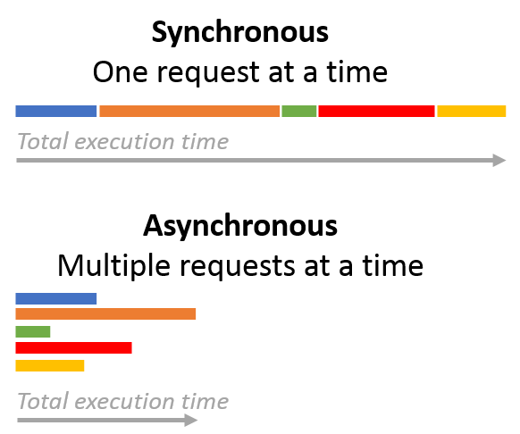

.. _concurrent-asynchronous:

Concurrency and Asynchronous Programming
========================================

This section describes what is meant by :ref:`concurrency` and :ref:`asynchronous-programming`.
The `presentation <https://youtu.be/M-UcUs7IMIM>`_ by Robert Smallshire provides a nice overview of
concurrent programming and Python's :mod:`asyncio` module.

.. _concurrency:

Concurrency
-----------
*Concurrent programming* uses a single thread to execute multiple tasks in an interleaved fashion. This is
different from *parallel programming* where multiple tasks can be executed at the same time.

The Network :class:`~msl.network.manager.Manager` uses *concurrent programming*. It runs in a single event loop
but it can handle multiple :class:`~msl.network.client.Client`\'s and :class:`~msl.network.service.Service`\'s
connected to it simultaneously.

When a :class:`~msl.network.client.Client` sends a request, the :class:`~msl.network.manager.Manager`
forwards the request to the appropriate :class:`~msl.network.service.Service` and then the
:class:`~msl.network.manager.Manager` waits for another event to occur. Whether the event is a reply from a
:class:`~msl.network.service.Service`, another request from a :class:`~msl.network.client.Client` or a new device
wanting to connect to the :class:`~msl.network.manager.Manager`, the :class:`~msl.network.manager.Manager` simply
waits for I/O events and forwards an event to the appropriate network device when an event becomes available.

Since the :class:`~msl.network.manager.Manager` is running in a single thread it can only process one event at a
single instance in time. In typical use cases, this does not inhibit the performance of the
:class:`~msl.network.manager.Manager` since the :class:`~msl.network.manager.Manager` has the sole responsibility
of routing requests and replies through the network and it does not actually execute a request. *There are*
*rare situations when an administrator is making a request for the* :class:`~msl.network.manager.Manager`
*to execute and in these situations the* :class:`~msl.network.manager.Manager` *would be executing the request, see*
:meth:`~msl.network.client.Client.admin_request` *for more details*.

The :class:`~msl.network.manager.Manager` can become slow if it is (de)serializing a large
`JSON <http://www.json.org/>`_ object or sending a large amount of bytes through the network. For example,
if a reply from a :class:`~msl.network.service.Service` is 1 GB in size and the network speed is 1 Gbps
(125 MB/s) then it will take at least 8 seconds for the data to be transmitted. During these 8 seconds the
:class:`~msl.network.manager.Manager` will be unresponsive to other events until it finishes sending all 1 GB of
data.

If the request for, or reply from, a :class:`~msl.network.service.Service` consumes a lot of the processing time
of the :class:`~msl.network.manager.Manager` it is best to start another instance of the
:class:`~msl.network.manager.Manager` on another port to host the :class:`~msl.network.service.Service`.

.. _asynchronous-programming:

Asynchronous Programming
------------------------

A :class:`~msl.network.client.Client` can send requests either *synchronously* or *asynchronously*. Synchronous
requests are sent sequentially and the :class:`~msl.network.client.Client` must wait to receive the reply before
proceeding to send the next request. These are blocking requests where the total execution time to receive all
replies is the combined sum of executing each request individually. Asynchronous requests do not wait for the
reply but immediately return a :class:`~asyncio.Future` object, which is an object that is a *promise* that a
result will be available later (i.e., in the future). These are non-blocking requests where the total execution
time to receive all replies is equal to the time it takes to execute the longest-running request.

.. _synchronous:

Synchronous Example
+++++++++++++++++++

The following code illustrates how to send requests *synchronously*. Before you can run this example on your own
computer make sure to :ref:`start-manager` and :ref:`start-service`.

.. code-block:: python

   ## synchronous.py

   import time
   from msl.network import connect

   # connect to the Manager (that is running on the same computer)
   cxn = connect()

   # establish a link to the BasicMath Service
   bm = cxn.link('BasicMath')

   # start a counter (used to determine the total execution time for getting all results)
   t0 = time.perf_counter()

   # send all requests synchronously
   # the returned object is the expected result for each request
   add = bm.add(1, 2)
   subtract = bm.subtract(1, 2)
   multiply = bm.multiply(1, 2)
   divide = bm.divide(1, 2)
   is_positive = bm.ensure_positive(1)
   power = bm.power(2, 4)

   # the amount of time that passed to receive all results from the BasicMath Service
   dt = time.perf_counter() - t0

   # print the results and the total execution time
   print('1+2= %f' % add)
   print('1-2= %f' % subtract)
   print('1*2= %f' % multiply)
   print('1/2= %f' % divide)
   print('is positive? %s' % is_positive)
   print('2**4= %f' % power)
   print('Total execution time: %f seconds' % dt)

   # disconnect from the Manager
   cxn.disconnect()

The output of the ``synchronous.py`` program will be::

   1+2= 3.000000
   1-2= -1.000000
   1*2= 2.000000
   1/2= 0.500000
   is positive? True
   2**4= 16.000000
   Total execution time: 21.059383 seconds

The *Total execution time* value will be slightly different for you, but the important thing to notice is that
executing all requests took about 21 seconds (i.e., 1+2+3+4+5+6=21 for the :func:`time.sleep` functions in the
:ref:`basic-math-service`) and that the returned object from each request was the value of the result.

.. _asynchronous:

Asynchronous Example
++++++++++++++++++++

The following code illustrates how to send requests *asynchronously*. Before you can run this example on your own
computer make sure to :ref:`start-manager` and :ref:`start-service`.

.. code-block:: python

   ## asynchronous.py

   import time
   from msl.network import connect

   # connect to the Manager (that is running on the same computer)
   cxn = connect()

   # establish a link to the BasicMath Service
   bm = cxn.link('BasicMath')

   # start a counter (used to determine the total execution time for getting all results)
   t0 = time.perf_counter()

   # create asynchronous requests by using the asynchronous=True keyword argument
   # the returned object is a Future object and not the expected result for each request
   add = bm.add(1, 2, asynchronous=True)
   subtract = bm.subtract(1, 2, asynchronous=True)
   multiply = bm.multiply(1, 2, asynchronous=True)
   divide = bm.divide(1, 2, asynchronous=True)
   is_positive = bm.ensure_positive(1, asynchronous=True)
   power = bm.power(2, 4, asynchronous=True)

   # send all requests (this blocks the program until all results are available)
   cxn.send_pending_requests()

   # the amount of time that passed to receive all results from the BasicMath Service
   dt = time.perf_counter() - t0

   # print the results and the total execution time
   # since an asynchronous request returns a Future object we must get the result from the Future
   print('1+2= %f' % add.result())
   print('1-2= %f' % subtract.result())
   print('1*2= %f' % multiply.result())
   print('1/2= %f' % divide.result())
   print('is positive? %s' % is_positive.result())
   print('2**4= %f' % power.result())
   print('Total execution time: %f seconds' % dt)

   # disconnect from the Manager
   cxn.disconnect()

The output of the ``asynchronous.py`` program will be::

   1+2= 3.000000
   1-2= -1.000000
   1*2= 2.000000
   1/2= 0.500000
   is positive? True
   2**4= 16.000000
   Total execution time: 6.009762 seconds

The *Total execution time* value will be slightly different for you, but the important thing to notice is that
executing all requests took about 6 seconds (i.e., max(1, 2, 3, 4, 5, 6) for the :func:`time.sleep` functions in the
:ref:`basic-math-service`) and that the returned object from each request was a :class:`~asyncio.Future` object.

Synchronous vs Asynchronous comparison
++++++++++++++++++++++++++++++++++++++

Comparing the total execution time for the :ref:`synchronous` and the :ref:`asynchronous` we see that the asynchronous
program is 3.5 times faster. Choosing whether to send a request synchronously or asynchronously is performed by passing
in an ``asynchronous=False`` or ``asynchronous=True`` keyword argument, respectively. Also, in the synchronous example
when a request is sent the object that is returned is the result of the method from the :ref:`basic-math-service`,
whereas in the asynchronous example the returned value is a :class:`~asyncio.Future` object that provides the result
later.

+-----------------------------+------------------------------+-----------------------------------+
|                             |   Synchronous                |   Asynchronous                    |
+=============================+==============================+===================================+
| Total execution time        |    21 seconds                |     6 seconds                     |
+-----------------------------+------------------------------+-----------------------------------+
| Keyword argument to invoke  | asynchronous=False (default) |  asynchronous=True                |
+-----------------------------+------------------------------+-----------------------------------+
| Returned value from request |    the result                | a :class:`~asyncio.Future` object |
+-----------------------------+------------------------------+-----------------------------------+
