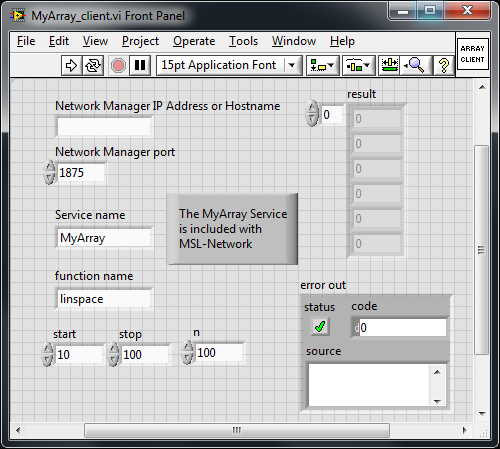
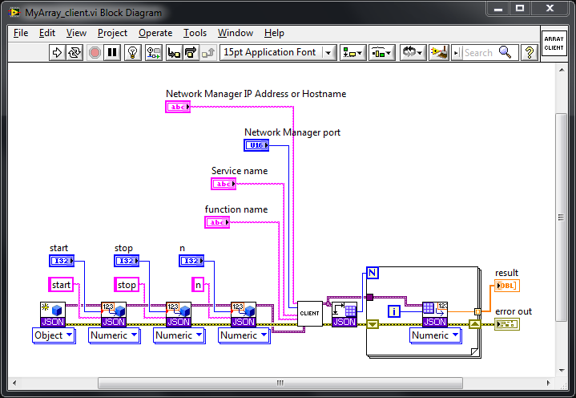
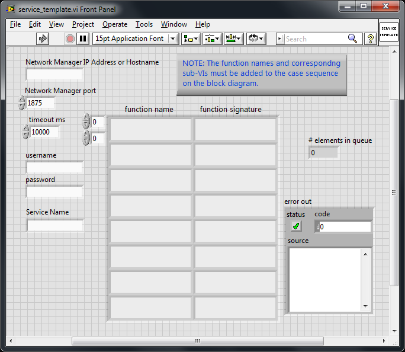
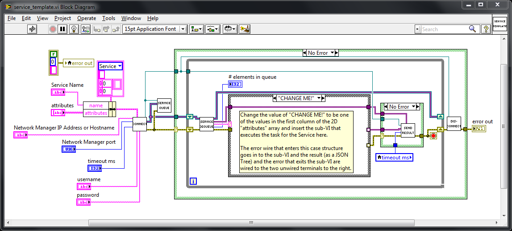
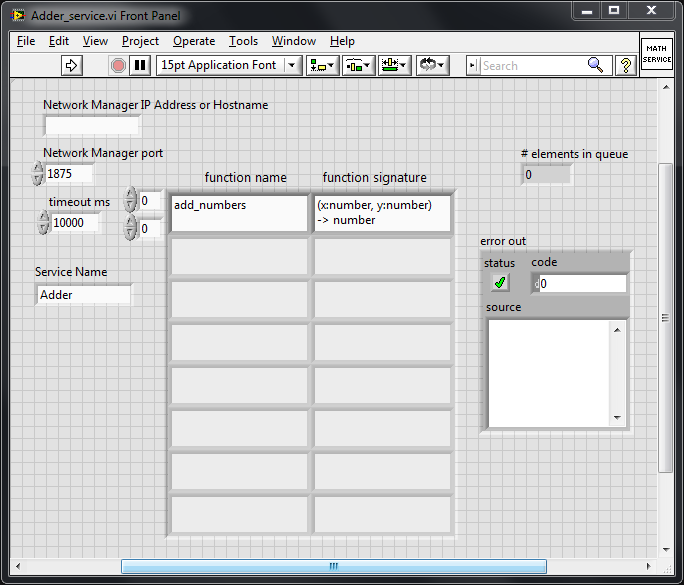
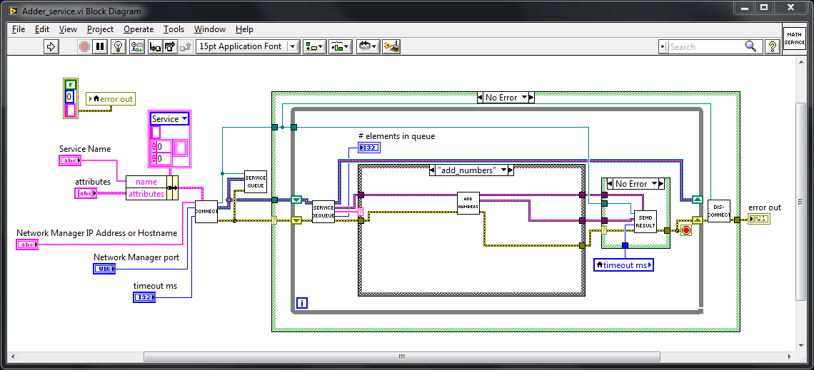

.. _network-labview:

LabVIEW
=======

The following illustrates how to use LabVIEW to send requests as a Client and receive requests as a Service.
The source code is available to download from the repository_. The VI's have been saved with
LabVIEW 2010. The LabVIEW code uses the `i3 JSON Toolkit`_, which is bundled with the code in the repository_,
to (de)serialize JSON_ data.

The first step is to :ref:`start-manager`. Since LabVIEW does not natively support the TLS_ protocol you must
start the Network :class:`~msl.network.manager.Manager` with the ``--disable-tls`` flag, and, to simplify the
examples below, do not use any authentication, i.e., run:

.. code-block:: console

   msl-network start --disable-tls

The *address* and *port* number that the Network :class:`~msl.network.manager.Manager` is running on will
be displayed. These values will need to be entered in the front panel of the VI's shown below.

.. code-block:: console

   ... [INFO ] msl.network.manager - Network Manager running on <address>:<port> (TLS DISABLED)

Client
------
The following shows how to send a request to the :ref:`myarray-service`. Before running ``MyArray_client.vi``
make sure that the :ref:`myarray-service` is running on the Network :class:`~msl.network.manager.Manager`

.. code-block:: console

   python -c "from msl.examples.network import MyArray; MyArray().start()"

On the front panel of ``MyArray_client.vi`` you need to enter the *address* and *port* values that the
Network :class:`~msl.network.manager.Manager` is running on (see above). The *Service name* and *function name* values
on the front panel do not need to be changed for this example. By changing the values of the *start*, *stop* and *n*
parameters the *result* array will be populated when you run the VI.

Service
-------
The ``service_template.vi`` file is a template to use for creating a new Service. The controls on the front panel
of the VI are as follows:

* *Network Manager IP Address or Hostname* and *Network Manager port*: The *address* and *port* values that
  the Network :class:`~msl.network.manager.Manager` is running on (see above).

* *timeout ms*: The maximum number of milliseconds to wait to connect to the Network
  :class:`~msl.network.manager.Manager`.

* *username* and *password*: Since the Network :class:`~msl.network.manager.Manager` can be started using different
  types of authentication for a Client or Service to be allowed to connect to it you can specify the values here.
  If the *username* and/or *password* values are not specified and the Network :class:`~msl.network.manager.Manager`
  requires these values for the connection then LabVIEW will prompt you for these values.

* *Service Name*: The name of your Service as it will appear on the Network :class:`~msl.network.manager.Manager`.

* *function name* and *function signature*: These are used to let a Client know what functions your Service provides,
  what input parameters are needed for each function and what each function returns. For more details see the
  comments in the ``Service -> attributes`` section in the :meth:`~msl.network.network.Network.identity` method.

The case sequence on the block diagram needs to be updated for each function that your Service provides

Adder Service
+++++++++++++
As a particular example of implementing a Service in LabVIEW the following VI shows an *Adder* Service. This Service
has a function called *add_numbers* that takes two numbers as inputs, *x* and *y*, and returns the sum.

Note that the name of the *add_numbers* function is specified on the front panel (which lets Clients know that
this function exists) and in the case structure on the block diagram (which processes a Client's request).

Run ``Adder_service.vi`` to start the *Adder* Service and then on another computer you can send a request
to the *Adder* Service

.. code-block:: pycon

   >>> from msl.network import connect
   >>> cxn = connect(host='change to be the hostname of the computer that is running the Manager')

establish a link with the *Adder* Service:

.. code-block:: pycon

   >>> adder = cxn.link('Adder')

and send a request to the *Adder* Service:

.. code-block:: pycon

   >>> adder.add_numbers(x=1.2, y=3.4)
   4.6

Disconnect from the Network :class:`~msl.network.manager.Manager` when you are finished

.. code-block:: pycon

   >>> cxn.disconnect()

.. _repository: https://github.com/MSLNZ/msl-network/tree/master/external/labview
.. _i3 JSON Toolkit: https://forums.ni.com/t5/JSON-Toolkit-for-LabVIEW/gp-p/8520
.. _JSON: https://www.json.org/
.. _TLS: https://en.wikipedia.org/wiki/Transport_Layer_Security
